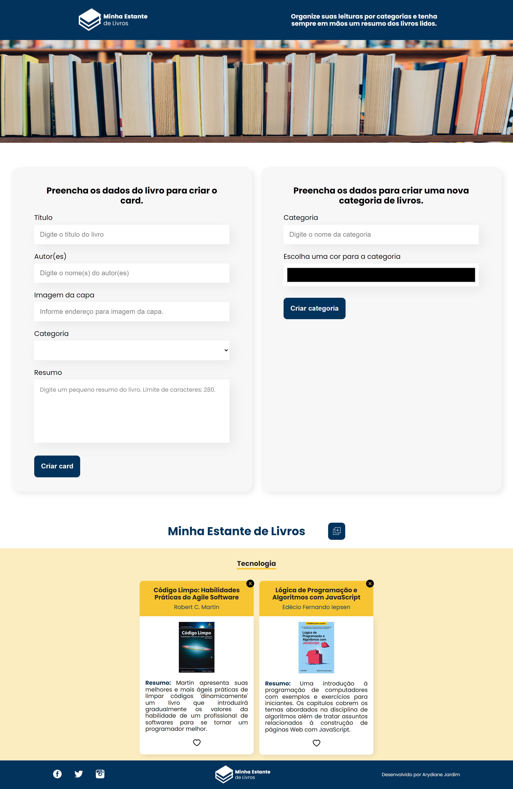

# Projeto Minha Estante de Livros

O site Minha Estante de Livros permite organizar todos os livros lidos pelo usuário. Nele é possivel favoritar os livros que mais gostou, cadastrar novas categorias e resumos como também excluir livros cadastrados. 

<strong>O objetivo do projeto é praticar os seguintes conceitos:</strong> 

- Implementar componentes da interface do usuário com estado
- Componentes Controlados
- Utilizar o CSS modules e o Sass
- Absolute imports

## 💻 Layout  

### Web

  

 ## 🔧 Tecnologias 

As tecnologias usadas foram: 
* React
* JavaScript
* Sass

## 🛠️ Abrir e rodar o projeto
Para abrir e rodar o projeto, execute npm i para instalar as dependências e npm start para inicar o projeto.

Depois, acesse http://localhost:3000/ no seu navegador.
